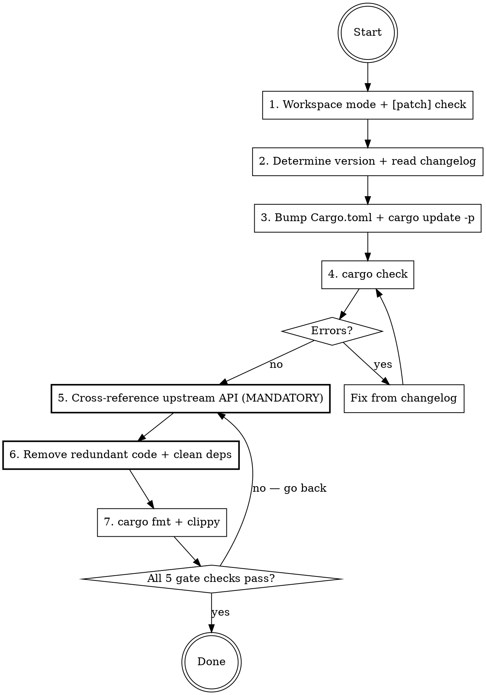

# Bump Upstream Dependencies

## Overview

Bump upstream Rust crate versions across Ethereum ecosystem repos (reth, foundry), handling cross-cutting dependencies and `[patch]` git overrides.

**Core principle:** A bump is NOT done when `cargo check` passes. It is done when redundant local code is removed and `cargo fmt + clippy` is clean.

## The Completion Gate

```
BEFORE claiming the bump is complete, you MUST have evidence of ALL:

1. ✅ cargo check --workspace --all-features passes
2. ✅ Upstream public API cross-referenced against local code (Step 7 output)
3. ✅ Redundant local code removed or justified
4. ✅ cargo +nightly fmt --all produces no changes
5. ✅ cargo +nightly clippy --workspace --all-features is clean

Missing ANY of these = bump is NOT complete. Do NOT commit.
```

## Red Flags — STOP and Go Back

- `cargo check` passed and you're about to commit → **STOP. Step 7 is not done.**
- You skipped the upstream API cross-reference → **STOP. Run it now.**
- You found matching names but decided "it's probably different" → **STOP. Read both implementations.**
- You're about to say "Done" without `cargo fmt` output → **STOP. Run it.**

## Rationalization Prevention

| Excuse | Reality |
|--------|---------|
| "cargo check passes, we're done" | Compilation ≠ completion. Redundant local code is tech debt. Step 7 is mandatory. |
| "The cross-reference didn't find anything" | Show the output. If you didn't run it, run it now. |
| "Same name but different implementation" | Read both. If upstream's version works, delete local. |
| "Removing code is risky" | Keeping redundant code is riskier — it diverges silently from upstream. |
| "I'll clean up in a follow-up" | No. Clean bump = one PR. Upstream maintainers do it in one commit. |
| "The upstream API check is slow" | It reads files already on disk. It takes seconds. |

## Dependency Matrix

```
            alloy-core
           ╱    │     ╲
        alloy   │    revm
           ╲    │     ╱
          alloy-evm (bridge)
           ╱       ╲
        reth      foundry
```

You MUST bump all crates within a family together:

| Family | Sub-crates |
|--------|-----------|
| **alloy-core** | alloy-primitives, alloy-sol-types, alloy-dyn-abi, alloy-rlp |
| **alloy** | alloy-consensus, alloy-eips, alloy-network, alloy-provider, alloy-rpc-types, alloy-signer, alloy-transport, etc. |
| **revm** | revm, revm-interpreter, revm-context, revm-handler, revm-inspector, revm-precompile, etc. |
| **alloy-evm** | alloy-evm |
| **op-alloy** | op-alloy-consensus, op-alloy-rpc-types, op-revm, etc. |

A major revm bump requires alloy-evm update first or simultaneously.

## Execution Flow



## Step-by-Step

### 1. Detect workspace mode and [patch] overrides

```bash
grep -c 'workspace = true' crates/*/Cargo.toml 2>/dev/null
grep -c 'git.*alloy\|git.*revm' Cargo.toml
```
- High workspace count → only change root `Cargo.toml`
- Active `[patch]` overrides → must update git rev/branch AND version must match exactly (silently ignored otherwise)

### 2. Determine target version and read changelog

```bash
cargo search alloy-evm --limit 1          # stable
gh api repos/alloy-rs/alloy/releases --jq '.[0].tag_name'  # pre-release
gh api repos/alloy-rs/evm/releases/latest --jq '.body' | head -50  # changelog
```
Look for: BREAKING, renamed types, changed trait bounds, feature flag renames, **new exports**.

### 3. Bump versions and update lockfile

Edit `Cargo.toml`, then update `Cargo.lock` precisely:
```bash
cargo update -p revm -p revm-database -p revm-interpreter -p revm-database-interface -p revm-inspectors -p alloy-evm
```

**NEVER** `git checkout -- Cargo.lock` — that resets all transitive deps and introduces unrelated changes.

### 4. Fix compilation errors

```bash
cargo check --workspace --all-features
```
Common fixes: renamed types (search-replace), changed trait bounds (update impls), removed re-exports (add direct dep).

### 5. Cross-reference upstream API against local code (MANDATORY)

**This step is NOT optional. Do NOT skip it. Do NOT commit without completing it.**

```bash
# Locate the upstream crate's source (already on disk from cargo)
upstream_dir=$(cargo metadata --format-version 1 --no-deps 2>/dev/null | \
  python3 -c "import sys,json; pkgs=json.load(sys.stdin)['packages']; print([p['manifest_path'] for p in pkgs if p['name']=='TARGET_CRATE'][0])" | \
  xargs dirname)

# Extract all public type/struct/trait/fn names from upstream
upstream_names=$(grep -roh 'pub \(struct\|trait\|fn\) \w\+' "$upstream_dir/src/" | awk '{print $3}' | sort -u)

# Cross-reference: find local code with the same names
for name in $upstream_names; do
  matches=$(grep -rn "struct $name\|trait $name\|fn $name" crates/ --include='*.rs' -l 2>/dev/null)
  [ -n "$matches" ] && echo "  $name -> $matches"
done
```

For each match:
1. Read the upstream implementation
2. Read the local implementation
3. If upstream provides equivalent functionality → **delete local, use upstream import**
4. If genuinely different → keep, but document why

### 6. Clean up after removing code

- Remove unused dependencies from member crate `Cargo.toml` files
- Remove dead re-exports
- Remove orphaned test helpers

### 7. Format and lint

```bash
cargo +nightly fmt --all
cargo +nightly clippy --workspace --all-features
```

### 8. Verify the Completion Gate

Before committing, confirm ALL five checks pass. If any fails, go back to the relevant step.

### 9. Commit

```
chore(deps): bump <family> from X to Y

Updated: <list of bumped crates>
Breaking changes: <brief summary>
Removed: <redundant local code replaced by upstream>
```

## Critical Pitfalls

| Pitfall | What happens | Fix |
|---------|-------------|-----|
| Blanket `Cargo.lock` reset | Introduces unrelated transitive dep changes | Use `cargo update -p <crate>` only |
| `[patch]` version mismatch | Patch silently ignored, incompatible deps | Ensure `[dependencies]` and `[patch]` versions match exactly |
| Bump one family, miss another | e.g. bump alloy but not alloy-core | Check all families in the matrix |
| Ignore pre-release channel | `cargo search` shows stable but repo uses rc | Use `gh api` for GitHub releases |
| Major revm bump without alloy-evm | Incompatible bridge layer | Bump alloy-evm first or simultaneously |
| **Stop after cargo check passes** | **Redundant local code remains as tech debt** | **Step 5 is mandatory — cross-reference upstream API** |
| Skip rustfmt | Formatting drift from trait bound changes | Always `cargo +nightly fmt --all` before commit |
