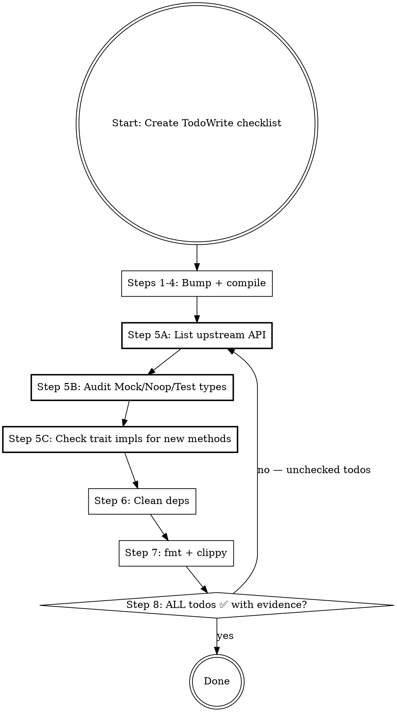

# Bump Upstream Dependencies

## Overview

Bump upstream Rust crate versions across Ethereum ecosystem repos (reth, foundry), handling cross-cutting dependencies and `[patch]` git overrides.

**Core principle:** A bump is NOT done when `cargo check` passes. It is done when ALL checklist items are completed.

**Announce at start:** "I'm using the bump-upstream-deps skill." Then immediately create the TodoWrite checklist below.

## MANDATORY: Create TodoWrite Checklist

**Upon loading this skill, you MUST immediately create todos using TodoWrite with these EXACT items.** Do NOT proceed without creating the checklist. Do NOT combine items. Each item is a separate todo.

```
[ ] Step 1: Detect workspace mode and [patch] overrides
[ ] Step 2: Read changelog for target version
[ ] Step 3: Bump Cargo.toml versions + cargo update -p
[ ] Step 4: cargo check — fix all compilation errors
[ ] Step 5A: Locate upstream source, list public API (paste output)
[ ] Step 5B: Audit local Mock/Noop/Test types for simplification (paste grep + decisions)
[ ] Step 5C: Check local trait impls for new upstream methods (paste grep + findings)
[ ] Step 6: Remove unused deps from member Cargo.toml files
[ ] Step 7: cargo +nightly fmt --all && cargo +nightly clippy --workspace --all-features
[ ] Step 8: Verify ALL gate checks pass
```

**Mark each todo as completed ONLY after you have done the work AND pasted evidence.**

You may NOT mark Step 5A-5C as complete without pasted command output. "I checked" is not evidence.

## The Completion Gate

```
BEFORE claiming the bump is complete, ALL todos must be ✅ with evidence:

1. ✅ cargo check --workspace --all-features passes
2. ✅ Step 5A output pasted (upstream public API)
3. ✅ Step 5B output pasted (local Mock/Noop/Test audit with decisions)
4. ✅ Step 5C output pasted (local trait impls checked for new methods)
5. ✅ cargo +nightly fmt --all produces no changes
6. ✅ cargo +nightly clippy --workspace --all-features is clean

Missing ANY = bump is NOT complete. Do NOT commit.
Any todo without pasted evidence = NOT complete. Run the commands.
```

## Red Flags — STOP and Go Back

- `cargo check` passed and you're about to commit → **STOP. Check your todo list. Steps 5-7 are not done.**
- Step 5A-5C todos are unchecked → **STOP. You skipped them.**
- You're marking Step 5A-5C complete without pasted output → **STOP. That's not evidence.**
- You found local `Mock*`/`Test*` types but didn't ask "can this be a type alias to Noop?" → **STOP. Read Step 5B again.**
- Local `Noop*` types exist but you didn't check for new trait methods → **STOP. Run Step 5C.**
- You're about to say "Done" without `cargo fmt` output → **STOP. Run it.**

## Rationalization Prevention

| Excuse | Reality |
|--------|---------|
| "cargo check passes, we're done" | Check your todo list. Steps 5A-5C are not marked complete. |
| "The cross-reference didn't find anything" | Show the output. If the todo has no evidence, it's not done. |
| "The Mock type is different from upstream" | That's not the question. The question is: can it be REPLACED by a simpler type (like Noop)? Read Step 5B. |
| "Removing code is risky" | Keeping 200+ lines of mock code when a 1-line type alias works is riskier — it diverges silently. |
| "I'll clean up in a follow-up" | No. Clean bump = one PR. Your todo list says otherwise. |
| "The upstream API check is slow" | It reads files already on disk. It takes seconds. |
| "I checked mentally / I already know the API" | Not evidence. The todo requires pasted output. Run the commands. |
| "cargo check passes so trait impls are fine" | Default impls mask incomplete implementations. Step 5C exists for this reason. |
| "It's just a Noop, nobody uses it" | Noop types are used in tests and as type-system placeholders. Check them. |

## Dependency Matrix

```
            alloy-core
           ╱    │     ╲
        alloy   │    revm
           ╲    │     ╱
          alloy-evm (bridge)
           ╱       ╲
        reth      foundry
```

You MUST bump all crates within a family together:

| Family | Sub-crates |
|--------|-----------|
| **alloy-core** | alloy-primitives, alloy-sol-types, alloy-dyn-abi, alloy-rlp |
| **alloy** | alloy-consensus, alloy-eips, alloy-network, alloy-provider, alloy-rpc-types, alloy-signer, alloy-transport, etc. |
| **revm** | revm, revm-interpreter, revm-context, revm-handler, revm-inspector, revm-precompile, etc. |
| **alloy-evm** | alloy-evm |
| **op-alloy** | op-alloy-consensus, op-alloy-rpc-types, op-revm, etc. |

A major revm bump requires alloy-evm update first or simultaneously.

## Execution Flow



## Step-by-Step

### Step 1. Detect workspace mode and [patch] overrides

```bash
grep -c 'workspace = true' crates/*/Cargo.toml 2>/dev/null
grep -c 'git.*alloy\|git.*revm' Cargo.toml
```
- High workspace count → only change root `Cargo.toml`
- Active `[patch]` overrides → must update git rev/branch AND version must match exactly (silently ignored otherwise)

**→ Mark todo "Step 1" complete.**

### Step 2. Determine target version and read changelog

```bash
cargo search alloy-evm --limit 1          # stable
gh api repos/alloy-rs/alloy/releases --jq '.[0].tag_name'  # pre-release
gh api repos/alloy-rs/evm/releases/latest --jq '.body' | head -50  # changelog
```
Look for: BREAKING, renamed types, changed trait bounds, feature flag renames, **new exports**.

**→ Mark todo "Step 2" complete.**

### Step 3. Bump versions and update lockfile

Edit `Cargo.toml`, then update `Cargo.lock` precisely:
```bash
cargo update -p revm -p revm-database -p revm-interpreter -p revm-database-interface -p revm-inspectors -p alloy-evm
```

**NEVER** `git checkout -- Cargo.lock` — that resets all transitive deps and introduces unrelated changes.

**→ Mark todo "Step 3" complete.**

### Step 4. Fix compilation errors

```bash
cargo check --workspace --all-features
```
Common fixes: renamed types (search-replace), changed trait bounds (update impls), removed re-exports (add direct dep).

**→ Mark todo "Step 4" complete only when cargo check passes.**

### Step 5A. Locate upstream source and list public API

```bash
# Find the upstream source on disk (already downloaded by cargo)
find ~/.cargo/registry/src -path "*/<CRATE_NAME>-<NEW_VERSION>/src/lib.rs" 2>/dev/null | head -1

# List all public items in the new version
grep -rn 'pub \(struct\|trait\|fn\|type\|use\) ' <UPSTREAM_SRC_DIR>/src/ | head -60
```

**→ Paste the output. Mark todo "Step 5A" complete.**

### Step 5B. Audit local Mock/Noop/Test types — can they be simplified?

**This is the most commonly missed step.** After API changes, local mock/test implementations often become unnecessarily complex. They may:
- Reimplement logic that a simpler existing type (like `NoopEvmConfig`) already handles
- Carry dependencies (e.g. `parking_lot`, `Arc<Mutex<Vec>>`) only needed for the old API
- Be replaceable by a one-line type alias to an existing simpler type

```bash
# Find ALL local Mock*, Noop*, Test*, Dummy* types related to the bumped crate's domain
grep -rn "struct Mock\|struct Noop\|struct Test\|struct Dummy" crates/ examples/ --include='*.rs'

# Also find test_utils modules — these are prime candidates for cleanup
find crates/ -name 'test_utils.rs' | head -10
```

**For each Mock/Test type found, ask these THREE questions:**
1. Read its full implementation — how many lines? What deps does it pull in?
2. After the API change, is this still the simplest way to satisfy the trait bounds?
3. Does an existing `Noop*` type in the codebase already satisfy the same bounds?

**If a simpler alternative exists → replace the complex mock with a type alias or re-export.**

**Real example (alloy-evm 0.27→0.28):** `MockEvmConfig` was 200+ lines with `Arc<Mutex<Vec<ExecutionOutcome>>>`, `parking_lot`, and a full custom `MockExecutor`. After the bump, `NoopEvmConfig` (already in the codebase) satisfied the same trait bounds. Fix: `pub type MockExecutorProvider = NoopEvmConfig;` — deleted 213 lines, removed 7 dependencies from `Cargo.toml`.

**→ Paste grep output AND your per-type decisions. Mark todo "Step 5B" complete.**

### Step 5C. Check local trait impls for new upstream methods

Bumps may add new methods to upstream traits with default impls — `cargo check` passes but local behavior is incomplete.

```bash
# Find all local impls of upstream traits that changed
grep -rn "impl.*BlockExecutorFactory\|impl.*BlockExecutor\b\|impl.*ConfigureEvm\|impl.*ConfigureEngineEvm" crates/ examples/ --include='*.rs'
```

For each local impl found:
1. Read the upstream trait definition in the new version (from Step 5A path)
2. Count: how many methods does the upstream trait have? How many does the local impl cover?
3. If upstream has new methods the local impl doesn't cover → **add explicit implementations**
4. `Noop*` types delegate to inner — new trait methods need new delegation entries

**Real example (alloy-evm 0.27→0.28):** `NoopEvmConfig` implemented `ConfigureEvm` but not the new `ConfigureEngineEvm` trait. The bump added 3 new methods (`evm_env_for_payload`, `context_for_payload`, `tx_iterator_for_payload`) that needed explicit delegation to inner. Without this, `NoopEvmConfig` couldn't be used where `ConfigureEngineEvm` was required.

**→ Paste the grep output and list findings. Mark todo "Step 5C" complete.**

### Step 6. Clean up

After Steps 5B/5C, check for cascading cleanup:
- Run `cargo +nightly clippy --workspace --all-features` — unused imports/deps show as warnings
- Remove unused dependencies from member crate `Cargo.toml` files
- Remove dead re-exports and orphaned test helpers

**→ Mark todo "Step 6" complete.**

### Step 7. Format and lint

```bash
cargo +nightly fmt --all
cargo +nightly clippy --workspace --all-features
```

**→ Mark todo "Step 7" complete only when both pass clean.**

### Step 8. Verify the Completion Gate

Review your todo list. **Every single item must be ✅.** If any item is unchecked, go back and complete it.

**→ Mark todo "Step 8" complete. NOW you may commit.**

### Step 9. Commit

```
chore(deps): bump <family> from X to Y

Updated: <list of bumped crates>
Breaking changes: <brief summary>
Removed: <redundant local code replaced by upstream>
```

## Critical Pitfalls

| Pitfall | What happens | Fix |
|---------|-------------|-----|
| Blanket `Cargo.lock` reset | Introduces unrelated transitive dep changes | Use `cargo update -p <crate>` only |
| `[patch]` version mismatch | Patch silently ignored, incompatible deps | Ensure `[dependencies]` and `[patch]` versions match exactly |
| Bump one family, miss another | e.g. bump alloy but not alloy-core | Check all families in the matrix |
| Ignore pre-release channel | `cargo search` shows stable but repo uses rc | Use `gh api` for GitHub releases |
| Major revm bump without alloy-evm | Incompatible bridge layer | Bump alloy-evm first or simultaneously |
| **Stop after cargo check passes** | **Redundant Mock/Test code remains when Noop suffices** | **Check todo list — Step 5B asks: can this be a type alias?** |
| **Complex mock survives bump** | **200+ lines of mock code when 1-line alias works** | **Step 5B: read the mock, check if Noop satisfies same bounds** |
| **Noop missing new trait methods** | **Silently incomplete, fails when used in new contexts** | **Step 5C: count upstream trait methods vs local impl methods** |
| Skip rustfmt | Formatting drift from trait bound changes | Always `cargo +nightly fmt --all` before commit |
