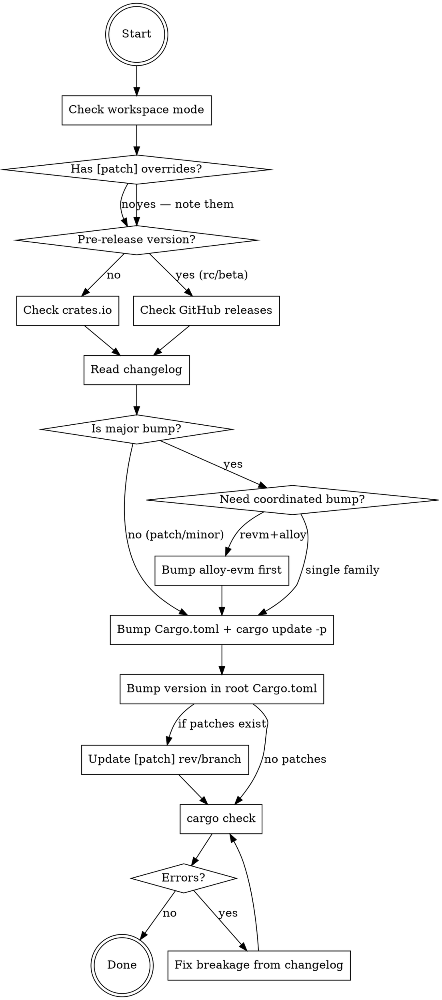

# Bump Upstream Dependencies

## Overview

Bump upstream Rust crate versions across Ethereum ecosystem repos, handling the cross-cutting dependency web and `[patch]` git overrides that break simple version bumps.

## When to Use

- User asks to bump/update/upgrade alloy, revm, or related crates
- User asks to check for outdated deps in reth, foundry, or similar projects
- Upstream released a new version and downstream needs to adopt it

## When NOT to Use

- Non-Rust projects
- Repos outside the alloy/revm ecosystem (use standard `cargo upgrade` instead)
- The user only wants to update `Cargo.lock` without changing version constraints (`cargo update` is enough)

## Dependency Matrix

Dependencies are cross-cutting, not linear. You MUST understand this before bumping:

```
            alloy-core
           ╱    │     ╲
        alloy   │    revm ←── uses alloy-core AND alloy crates
           ╲    │     ╱
          alloy-evm (bridge)
           ╱       ╲
        reth      foundry
```

| Project | alloy-core | alloy | revm | alloy-evm |
|---------|-----------|-------|------|-----------|
| alloy | ✓ | — | ✗ | ✗ |
| revm | ✓ | ✓ partial | — | ✗ |
| alloy-evm | ✓ | ✓ | ✓ | — |
| reth | ✓ | ✓ | ✓ | ✓ |
| foundry | ✓ | ✓ | ✓ | ✓ |

An alloy major bump can break revm. A revm major bump requires alloy-evm update first.

## Crate Families

You MUST bump all crates within a family together:

| Family | Sub-crates | Cross-deps |
|--------|-----------|------------|
| **alloy-core** | alloy-primitives, alloy-sol-types, alloy-dyn-abi, alloy-rlp | none (root) |
| **alloy** | alloy-consensus, alloy-eips, alloy-network, alloy-provider, alloy-rpc-types, alloy-signer, alloy-transport, etc. | uses alloy-core |
| **revm** | revm, revm-interpreter, revm-context, revm-handler, revm-inspector, revm-precompile, etc. | uses alloy-core + alloy (consensus, eips, provider) |
| **alloy-evm** | alloy-evm | uses alloy + revm (bridge layer) |
| **op-alloy** | op-alloy-consensus, op-alloy-rpc-types, op-revm, etc. | uses alloy + revm |

## Execution Flow



## Step-by-Step

### 1. Detect workspace mode (ALWAYS do this first)

```bash
grep -c 'workspace = true' crates/*/Cargo.toml 2>/dev/null
```
- High count → workspace inheritance, only change root `Cargo.toml`
- Zero → each member crate pins its own version, update all of them

### 2. Check for `[patch]` git overrides (CRITICAL)

```bash
grep -c 'git.*alloy\|git.*revm' Cargo.toml
```
If > 0: you CANNOT just change version numbers. The `[patch]` section overrides crates.io. You must update the git rev/branch too, AND the `[patch]` version must match `[dependencies]` exactly or it is **silently ignored**.

### 3. Determine target version

```bash
# Stable
cargo search alloy --limit 1

# Pre-release (crates.io doesn't show rc/beta)
gh api repos/alloy-rs/alloy/releases --jq '.[0].tag_name'
```
If repo currently uses a pre-release (e.g. `2.0.0-rc.0`), track that channel.

### 4. Read changelog BEFORE bumping

```bash
gh api repos/alloy-rs/alloy/releases/latest --jq '.body' | head -50
```
Look for: BREAKING, renamed types, changed trait bounds, feature flag renames.

### 5. Update Cargo.toml, then sync Cargo.lock

First apply version changes in `Cargo.toml`. Use `sed 's/= "OLD"/= "NEW"/g'` — this catches both formats:
```toml
alloy-dyn-abi = "1.5.2"                                # simple
alloy-primitives = { version = "1.5.2", features = [] } # inline table
```

### 6. Sync Cargo.lock precisely

Do NOT `git checkout -- Cargo.lock` — that resets all transitive deps and introduces unrelated changes. Instead, update only the target crates:

```bash
cargo update -p alloy-primitives -p alloy-sol-types  # for alloy-core bump
cargo update -p revm -p alloy-evm                     # for revm bump
```

If a previous failed bump polluted `Cargo.lock`, THEN reset it: `git checkout -- Cargo.lock`

### 7. Verify

```bash
cargo check
```
If errors:
- Read the error + the changelog you already fetched
- Common fixes: renamed types (search-replace), removed re-exports (add direct dep), changed trait bounds (update impls), feature flag renames

### 7. Commit

```
chore(deps): bump alloy-core from X to Y

Updated: alloy-primitives, alloy-sol-types, alloy-dyn-abi, ...
Changes: [brief summary from changelog]
```

## Critical Pitfalls

| Pitfall | What happens | Fix |
|---------|-------------|-----|
| Blanket `Cargo.lock` reset | `git checkout -- Cargo.lock` re-resolves ALL transitive deps, introducing unrelated changes | Use `cargo update -p <crate>` to update only target crates. Only reset Cargo.lock if a previous failed bump polluted it |
| `[patch]` version mismatch | Patch silently ignored, crates.io version used, incompatible transitive deps pulled in | Ensure `[dependencies]` and `[patch]` versions match exactly |
| Bump one family, miss another | e.g. bump alloy but not alloy-core when they released together | Check all families in the matrix |
| Ignore pre-release channel | `cargo search` shows stable 1.7.3 but repo uses 2.0.0-rc.0 | Use `gh api` for GitHub releases |
| Major revm bump without alloy-evm | alloy-evm bridges alloy+revm, must be compatible with both | Bump alloy-evm first or simultaneously |
